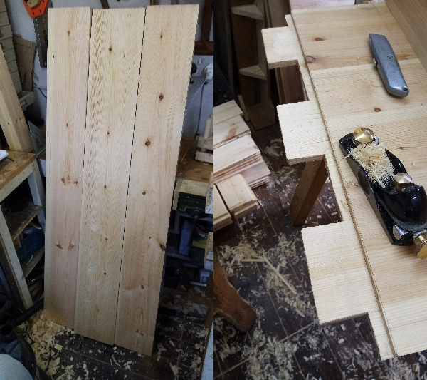

# Furniture

## Desk

Just after finishing my MPhil to PhD upgrade thesis, I took a few weeks off to build this desk, as a much needed change of pace.

This was my first project that used 'proper' woodworking joints without any screws or nails. The most difficult of these was the 'breadboard-ends' on the top surface of the desk. After glueing up the top panel, tenons were cut into the ends of the panel:

Next mortises were drilled out in the breadboard ends and finished with chisels:

The tenons were adjusted with hand planes and chisels until they fit tightly into the breadboard end mortises:

Breadboard ends allow the panel to expand perpendicular to its grain direction, in response to seasonal changes in humidity. Accordingly, the ends are glued to the panel only in the middle. Dowels are used to pin the mortises to the tenons, and the outer tenons have slots to allow the dowels to shift when the panel expands and contracts:

After hammering in the dowels, the transition between the panel and the breadboard end was smoothed out with a hand plane.

The table aprons and legs were also constructed using glued mortise and tenon joints, cut with chisels:

The top panel was finished with polyurethane varnish and the frame was painted with undercoat:

