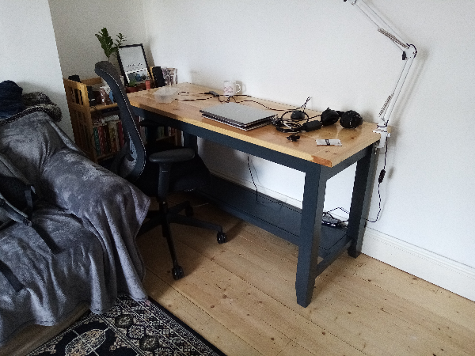
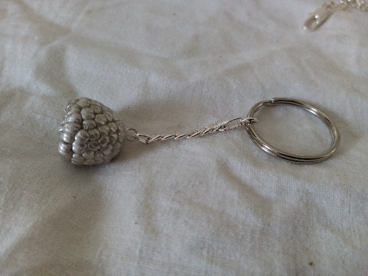

# Investment Casting

Ever since learning to solder electronics I have loved the experience of watching metal melt, and have always been very keen to try investment casting metal parts. 

Traditionally lost-wax investment casting involves [carving a wax pattern](https://youtu.be/v6eH5ado-8w?feature=shared) that acts as a positive, and then casting a mould around this pattern:

I was excited to find out that you can also use organic material to create a positive. Getting nature to do the hard work of carving a beautifully detailed pattern seemed too good to be true, and so some friends and I did some experiments!

The pieces here took ~4 years and many failed attempts, and there is still lots of room for improvement, but we enjoyed ourselves doing it.

## Silver Raspberries

We chose to cast raspberries because they have a unique pattern and are small enough to make a pendant or keyring.

First the best raspberries are selected and the rest are eaten:

Next, the wax sprue tree is formed and attached to a rubber flask base. After burnout the sprue will leave a channel in the mould for the metal to flow down:

Next the raspberries were attached to the sprue tree using cyanoacrylate glue. It was very dificult to get a good bond without damaging the delicate raspberry skin. A concave face was formed on the end of the sprue to match the curvature of the raspberry, since the low viscosity adhesive did not have good gap filling properties:

Next, the metal flask was placed over the rubber base - this forms a cavity to pour the investment mould mixture around the raspberries:

Next, investment powder was mixed with water and degassed in a vacuum chamber to remove air bubbles. This mould mixture was then poured gently into the flask, around the raspberries. The mixture has a short pot life of 7 minutes and we had to work fast:

After the mould is dry, the flask was turned over and the rubber base was removed. This leaves behind a conical indent revealing the top of the sprue, which is where the molten metal will later be poured:

To finish the mould, it is placed in a kiln. First the mould is held at 150 degrees C for 1 hour to melt the wax sprue and slowly evaporate the water from the raspberry. The mould is placed sprue-down to allow the liquids to drain. Next the temperature is slowly ramped up to 596 degrees C and held there for 2 hours, to burn off the raspberry solids and residual carbon left behind by the wax.

Industrially, more [carefully controlled burnout cycles](https://www.stuller.com/benchjeweler/resources/bencharticles/view/investing-and-burnout/) with longer duration are used with a higher burnout temperature of 730 degrees C. The [Kilns](kilns.md) page has more information about this homemade kiln and its upgrades to improve performance!

At the end of the burnout cycle the mould was held in the kiln at 450 degrees C. The silver was melted in an electric furnace at 1050 degrees C. Just before pouring the metal, the mould was removed from the kiln and placed onto a vacuum casting plate. This plate is connected to a vacuum pump, which draws air through the porous mould material and helps to pull the molten metal into the void:

 

Once the metal had solidified the part was removed from the mould by quenching it in water:

After cleanup, the raspberries were revealed! The gray colour is a thin oxidation layer. Industrially this is prevented by casting in an inert atmosphere.

To finish these pieces, the sprue tree was removed using a jewelery saw and files, and the oxide layer was removed using pickle (an acid). A silver jump ring was soldered in place for attaching to a chain:

After another pickling and then polishing, the piece was finally done!

## Bronze Walnuts

After our success with raspberries, we tried casting walnuts. The metal did not fully fill the void left behind by the walnuts, and we suspect this is because we fed metal only to the centre of the walnut, and it solidifed before flowing all the way to the extent of the nut. Next time we will add additional sprues to also feed metal to the edges.

## Bronze Pepper

